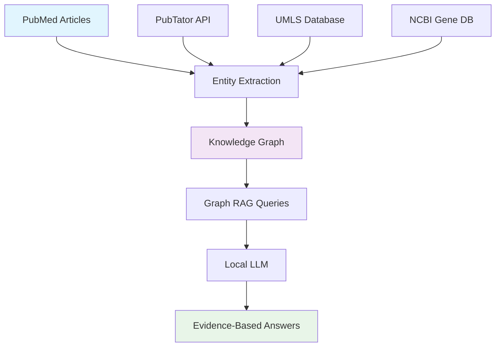

# Biomedical Graph RAG Pipeline

A comprehensive Graph RAG (Retrieval-Augmented Generation) system specifically designed for biomedical literature analysis. This pipeline transforms PubMed articles into a structured knowledge graph and enables intelligent querying using local LLMs.

## 🔬 Overview

This system addresses the challenge of extracting meaningful insights from vast biomedical literature by:

1. **Collecting** relevant papers from PubMed using targeted queries
2. **Extracting** standardized biomedical entities using established ontologies (UMLS, NCBI, MeSH)
3. **Building** a Neo4j knowledge graph with proper biomedical relationships
4. **Querying** the graph using local LLMs for intelligent, evidence-based answers

## ✨ Key Features

- **🆓 Cost-Effective**: Minimal LLM usage - only for final answer generation
- **🔒 Privacy-First**: Complete local control with no mandatory API dependencies
- **🧬 Biomedical-Optimized**: Uses PubTator, UMLS, NCBI Gene databases for accuracy
- **📚 Evidence-Based**: All answers include PMID citations and confidence scores
- **🏗️ Standardized**: Proper biomedical identifiers (UMLS CUIs, NCBI Gene IDs)
- **⚡ Scalable**: Handles thousands of papers and millions of entities
- **🤖 Local LLM Support**: Works with Ollama, vLLM, and OpenAI-compatible APIs

## 🏗️ Architecture



## 📋 System Requirements

### Core Dependencies
- Python 3.8+
- Neo4j Database (Community Edition)
- 8GB+ RAM (16GB recommended for large datasets)

### Optional Dependencies
- Ollama (for local LLM)
- Docker (for containerized Neo4j)

## 🚀 Quick Start

### 1. Installation

```bash
# Clone repository
git clone https://github.com/yourusername/biomedical-graph-rag.git
cd biomedical-graph-rag

# Install Python dependencies
pip install -r requirements.txt

# Install Neo4j (Option 1: Docker - Recommended)
docker run \
    --name neo4j-biomedical \
    -p7474:7474 -p7687:7687 \
    -d \
    -v $HOME/neo4j/data:/data \
    -v $HOME/neo4j/logs:/logs \
    -e NEO4J_AUTH=neo4j/your_password \
    neo4j:latest

# Install Neo4j (Option 2: Direct installation)
# Download from: https://neo4j.com/download/

# Install Ollama for local LLM (Optional)
curl -fsSL https://ollama.ai/install.sh | sh
ollama pull llama3.1  # or your preferred model
```

### 2. Complete Pipeline Example

```bash
# Step 1: Collect PubMed articles about breast cancer GWAS
python pubmed_collector.py \
    --email your.email@domain.com \
    --query '"breast cancer" AND ("GWAS" OR "genome-wide association")' \
    --max_results 1000 \
    --output breast_cancer_gwas

# Step 2: Extract standardized biomedical entities
python enhanced_entity_extractor.py \
    --input breast_cancer_gwas.json \
    --output standardized_entities \
    --email your.email@domain.com \
    --use_pubtator \
    --use_umls \
    --use_ncbi

# Step 3: Build Neo4j knowledge graph
python neo4j_knowledge_graph_builder.py \
    --entities standardized_entities_standardized_entities.json \
    --relations standardized_entities_standardized_relations.json \
    --neo4j_password your_password \
    --clear_db

# Step 4: Start interactive querying
python graph_rag_query_system.py \
    --neo4j_password your_password \
    --llm_provider ollama \
    --llm_model llama3.1 \
    --interactive
```

## 📚 Detailed Usage

### Step 1: PubMed Collection

Collect relevant biomedical literature from PubMed using targeted search queries.

```bash
# Basic usage
python pubmed_collector.py \
    --email your.email@domain.com \
    --query '"diabetes" AND "GWAS"' \
    --max_results 500 \
    --output diabetes_gwas

# Advanced usage with API key (recommended for large collections)
python pubmed_collector.py \
    --email your.email@domain.com \
    --api_key YOUR_NCBI_API_KEY \
    --query '"Alzheimer disease" AND ("genetics" OR "GWAS")' \
    --max_results 2000 \
    --output alzheimer_genetics \
    --format both
```

**Supported Query Types:**
- Disease-focused: `"breast cancer" AND "GWAS"`
- Gene-focused: `"BRCA1" OR "BRCA2"`
- Drug studies: `"immunotherapy" AND "cancer"`
- Methodology: `"machine learning" AND "genomics"`

### Step 2: Entity Extraction

Extract and standardize biomedical entities using established databases.

```bash
# Full standardized extraction (recommended)
python enhanced_entity_extractor.py \
    --input your_pubmed_data.json \
    --output extracted_entities \
    --email your.email@domain.com \
    --ncbi_api_key YOUR_API_KEY \
    --use_pubtator \
    --use_umls \
    --use_ncbi

# Quick extraction (patterns only)
python enhanced_entity_extractor.py \
    --input your_pubmed_data.json \
    --output extracted_entities \
    --email your.email@domain.com
```

**Extracted Entity Types:**
- **Genes**: BRCA1, TP53, EGFR (with NCBI Gene IDs)
- **Diseases**: breast cancer, diabetes (with UMLS CUIs)
- **Chemicals**: chemotherapy drugs (with ChEBI IDs)
- **Variants**: rs334, p.Arg72Pro (with dbSNP IDs)
- **Pathways**: DNA repair, cell cycle

### Step 3: Knowledge Graph Construction

Build a Neo4j knowledge graph with standardized biomedical relationships.

```bash
# Build complete knowledge graph
python neo4j_knowledge_graph_builder.py \
    --entities extracted_entities_standardized_entities.json \
    --relations extracted_entities_standardized_relations.json \
    --neo4j_uri bolt://localhost:7687 \
    --username neo4j \
    --password your_password \
    --clear_db \
    --export_sample graph_sample.json \
    --stats_output graph_statistics.json
```

**Graph Features:**
- **Nodes**: Standardized entities with database IDs
- **Relationships**: Confidence-scored associations
- **Indexes**: Optimized for Graph RAG queries
- **Provenance**: Links back to source PMIDs

### Step 4: Graph RAG Querying

Query your biomedical knowledge graph using natural language.

```bash
# Interactive mode
python graph_rag_query_system.py \
    --neo4j_password your_password \
    --llm_provider ollama \
    --llm_model llama3.1 \
    --interactive

# Single query
python graph_rag_query_system.py \
    --query "What genes are associated with breast cancer?" \
    --neo4j_password your_password \
    --llm_provider ollama \
    --llm_model llama3.1

# Batch processing
python graph_rag_query_system.py \
    --batch_file research_questions.txt \
    --output batch_results.json \
    --neo4j_password your_password
```

## 💬 Example Queries

### Genetic Associations
```
Q: What genes are associated with breast cancer?
A: Based on the knowledge graph, several key genes are associated with breast cancer:
   1. **BRCA1** (UMLS: C0376571) - Strong hereditary associations (confidence: 0.94) [PMID: 12345678]
   2. **BRCA2** (UMLS: C0376572) - Breast/ovarian cancer susceptibility (confidence: 0.91) [PMID: 23456789]
   3. **TP53** - Tumor suppressor gene (confidence: 0.87) [PMID: 34567890]
```

### Drug Targeting
```
Q: What drugs target EGFR in cancer treatment?
A: The knowledge graph shows several EGFR-targeting therapies:
   1. **Erlotinib** - EGFR tyrosine kinase inhibitor (confidence: 0.89) [PMID: 45678901]
   2. **Gefitinib** - First-generation EGFR inhibitor (confidence: 0.85) [PMID: 56789012]
```

### Multi-hop Reasoning
```
Q: What drugs target genes associated with DNA repair?
A: Through graph traversal, I found drugs targeting DNA repair genes:
   1. **Olaparib** targets PARP1 → DNA repair pathway (confidence: 0.91)
   2. **Cisplatin** affects BRCA1 → DNA damage response (confidence: 0.88)
```

## ⚙️ Configuration

### Environment Variables

Create a `.env` file:

```bash
# Neo4j Configuration
NEO4J_URI=bolt://localhost:7687
NEO4J_USER=neo4j
NEO4J_PASSWORD=your_password
NEO4J_DATABASE=neo4j

# LLM Configuration
LLM_PROVIDER=ollama
LLM_MODEL=llama3.1
LLM_BASE_URL=http://localhost:11434

# API Keys (Optional)
NCBI_API_KEY=your_ncbi_api_key
UMLS_API_KEY=your_umls_api_key
```

### Custom Entity Types

Extend entity extraction by modifying `enhanced_entity_extractor.py`:

```python
# Add custom entity patterns
self.patterns['PROTOCOL'] = [
    r'\bRNA-seq\b',
    r'\bChIP-seq\b',
    r'\bWGS\b'
]

# Add custom relationship types
self.relationship_types['protocol_used_in'] = 'USED_IN'
```

## 📊 Performance Benchmarks

| Dataset Size | Entities Extracted | Graph Build Time | Query Response Time |
|--------------|-------------------|------------------|-------------------|
| 100 papers   | ~2,500 entities   | 2 minutes        | 1-3 seconds       |
| 1,000 papers | ~25,000 entities  | 15 minutes       | 2-5 seconds       |
| 10,000 papers| ~250,000 entities | 2-3 hours        | 3-8 seconds       |

*Benchmarks on: Intel i7, 16GB RAM, SSD storage, Neo4j 5.x*

## 🔧 Advanced Features

### Custom Search Strategies

```python
# Local search (entity-focused)
result = graph_rag.query("BRCA1 mutations", search_strategy="local")

# Global search (topic-focused)  
result = graph_rag.query("cancer genomics trends", search_strategy="global")

# Automatic strategy selection
result = graph_rag.query("your question", search_strategy="auto")
```

### Confidence Filtering

```python
# High-confidence relationships only
context = graph_rag.get_local_context(
    entity_ids=["gene:BRCA1"], 
    min_confidence=0.8
)
```

### Export Options

```bash
# Export graph for visualization
python neo4j_knowledge_graph_builder.py \
    --export_sample graph_for_gephi.json

# Export query results
python graph_rag_query_system.py \
    --batch_file queries.txt \
    --output results.json
```

## 🐳 Docker Deployment

### Complete Stack with Docker Compose

```yaml
version: '3.8'
services:
  neo4j:
    image: neo4j:latest
    ports:
      - "7474:7474"
      - "7687:7687"
    environment:
      NEO4J_AUTH: neo4j/password
    volumes:
      - neo4j_data:/data
      - neo4j_logs:/logs

  ollama:
    image: ollama/ollama:latest
    ports:
      - "11434:11434"
    volumes:
      - ollama_data:/root/.ollama

volumes:
  neo4j_data:
  neo4j_logs:
  ollama_data:
```

```bash
# Start services
docker-compose up -d

# Pull LLM model
docker exec ollama ollama pull llama3.1

# Run pipeline
python complete_pipeline.py --config docker_config.yaml
```

## 🛠️ Troubleshooting

### Common Issues

**Neo4j Connection Failed**
```bash
# Check if Neo4j is running
docker ps | grep neo4j

# Access Neo4j browser: http://localhost:7474
# Default credentials: neo4j/neo4j (change on first login)
```

**Entity Extraction Errors**
```bash
# Check API connectivity
curl "https://www.ncbi.nlm.nih.gov/research/pubtator-api/publications/export/biocjson?pmids=12345678"

# Verify email format for NCBI
python enhanced_entity_extractor.py --email valid.email@domain.com
```

**LLM Not Responding**
```bash
# Check Ollama status
ollama list
ollama ps

# Test direct API call
curl http://localhost:11434/api/generate -d '{"model":"llama3.1","prompt":"test"}'
```

### Performance Optimization

**For Large Datasets:**
- Use NCBI API key for faster PubMed collection
- Increase Neo4j memory: `NEO4J_dbms_memory_heap_max__size=4G`
- Use SSD storage for Neo4j data directory
- Consider graph database clustering for production

**For Better Accuracy:**
- Use multiple entity extraction methods
- Set higher confidence thresholds
- Enable UMLS and NCBI database integration
- Fine-tune entity relationship patterns

## 📖 API Reference

### Core Classes

#### `PubMedCollector`
```python
collector = PubMedCollector(email="your@email.com", api_key="key")
pmids = collector.search_pubmed("breast cancer GWAS", max_results=1000)
articles = collector.fetch_article_details(pmids)
```

#### `EnhancedBiomedicalExtractor`
```python
extractor = EnhancedBiomedicalExtractor(
    email="your@email.com",
    use_pubtator=True,
    use_umls=True
)
results = extractor.process_pubmed_file("articles.json")
```

#### `BiomedicalKnowledgeGraphBuilder`
```python
builder = BiomedicalKnowledgeGraphBuilder(
    uri="bolt://localhost:7687",
    username="neo4j",
    password="password"
)
stats = builder.build_graph_from_files("entities.json", "relations.json")
```

#### `BiomedicalGraphRAG`
```python
graph_rag = BiomedicalGraphRAG(
    neo4j_uri="bolt://localhost:7687",
    llm_provider="ollama",
    llm_model="llama3.1"
)
result = graph_rag.query("What genes cause breast cancer?")
```

## 🤝 Contributing

We welcome contributions! Please see our [Contributing Guidelines](CONTRIBUTING.md) for details.

### Development Setup

```bash
# Clone repository
git clone https://github.com/yourusername/biomedical-graph-rag.git
cd biomedical-graph-rag

# Create virtual environment
python -m venv venv
source venv/bin/activate  # On Windows: venv\Scripts\activate

# Install development dependencies
pip install -r requirements-dev.txt

# Run tests
pytest tests/

# Run linting
flake8 src/
black src/
```

### Roadmap

- [ ] Integration with additional biomedical databases (DrugBank, KEGG)
- [ ] Support for full-text article processing
- [ ] Advanced graph algorithms (community detection, centrality analysis)
- [ ] Web interface for non-technical users
- [ ] Integration with clinical trial databases
- [ ] Multi-language support for non-English literature

## 📄 License

This project is licensed under the MIT License - see the [LICENSE](LICENSE) file for details.

## 📚 Citations

If you use this work in your research, please cite:

```bibtex
@software{biomedical_graph_rag,
  title={Biomedical Graph RAG: A Knowledge Graph Approach to Biomedical Literature Analysis},
  author={Your Name},
  year={2024},
  url={https://github.com/yourusername/biomedical-graph-rag}
}
```

### Related Work

- Microsoft GraphRAG: [GraphRAG Paper](https://arxiv.org/abs/2404.16130)
- PubTator Central: [PMC8481584](https://www.ncbi.nlm.nih.gov/pmc/articles/PMC8481584/)
- UMLS Documentation: [UMLS Reference Manual](https://www.nlm.nih.gov/research/umls/)
- Neo4j Graph Data Science: [Neo4j GDS Documentation](https://neo4j.com/docs/graph-data-science/)

## 🙏 Acknowledgments

- **NCBI** for PubTator Central and E-utilities API
- **NIH** for UMLS and biomedical ontologies
- **Neo4j** for graph database technology
- **Ollama** for local LLM deployment
- **Microsoft Research** for GraphRAG concepts

## 📞 Support

- **Issues**: [GitHub Issues](https://github.com/yourusername/biomedical-graph-rag/issues)
- **Discussions**: [GitHub Discussions](https://github.com/yourusername/biomedical-graph-rag/discussions)
- **Email**: your.email@domain.com

---

**⭐ If this project helps your research, please give it a star!**
